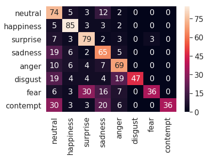
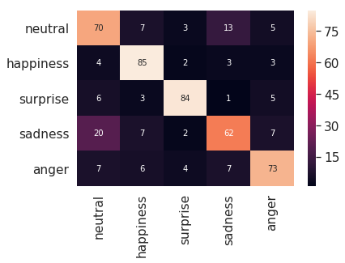

# emotion-recognition-vgg13
A VGG13 classifier on the FER+ emotion dataset

### Create FER+ dataset

A detailed Colab notebook is available [here](https://colab.research.google.com/drive/1Krp2hQUz5AGnnSJbp2dKSXefdfN6fQ4i) to help prepare the dataset

### Training and inference

To train a model,

```bash
python trainer.py
```

To inferencer using a trained model on a dataset

```bash
python inferece.py
```

## Results

1. Confustion matrix on FERTest2013 (8 emotions and weighted CE loss)

    

2. Confustion matrix on FERTest2013 (5 emotions and down-sampling) dataset with weighted CE loss

    


## Resources

[1] E. Barsoum, C. Zhang, C. C. Ferrer, and Z. Zhang, “FER+ : Training Deep Networks for Facial Expression Recognition with Crowd-Sourced Label Distribution.”

[2]


